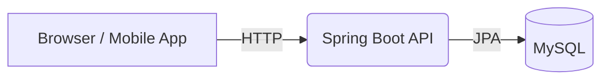
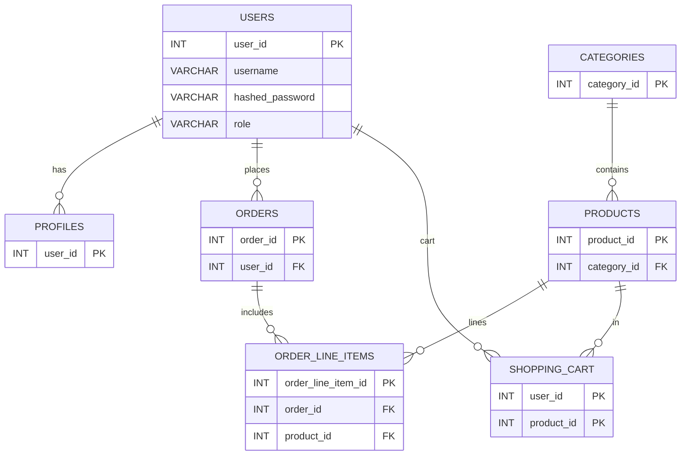

# EasyShop API Project Overview

EasyShop is a Spring Boot based e-commerce API that powers the sample storefront in `src/main/resources/static`. The API
provides endpoints for product browsing, shopping cart management and order checkout. Data is stored in a MySQL database
and secured using JWT authentication.

## Features

- User registration and login with JWT security
- Profile management
- Product and category CRUD (admin only)
- Shopping cart and checkout
- Swagger/OpenAPI documentation

## Technologies Used

- Java 17 with Spring Boot
- Spring Security with JSON Web Tokens (JWT)
- Spring Data JPA and Hibernate
- MySQL database (Docker container)
- Maven for build and dependency management
- JUnit and Mockito for testing

## Project Structure

```
docker-composer.yml      # MySQL container setup
src/main/java            # Spring Boot source code
src/main/resources       # Configuration & static frontend
src/main/resources/manual# SQL setup scripts and seed data
```

## Architecture



## Project Purpose & Description

EasyShop aims to demonstrate a full-stack e-commerce application. Customers browse products, manage their cart and place
orders while admins maintain the catalog and categories. The API can be used with the bundled HTML/JS frontend or a
custom SPA/mobile app that communicates with the backend.

## Authentication & Authorization

Authentication is handled with JWT. A token is created when the user logs in and must be sent on subsequent requests as
an `Authorization` header.

- **Roles**: `USER` can view products, manage their cart and place orders. `ADMIN` has additional permissions to manage
  products and categories.
- **Expiration**: token lifetime is configured via `jwt.token-timeout-seconds` in `application.yml` (default 108000
  seconds). Clients must refresh by logging in again when expired.
- **Validation**: every request passes through `JwtFilter` which validates the signature and loads the user's
  authorities.

## Swagger Documentation

The API is documented using Swagger. Visit:

```
http://localhost:8080/swagger-ui/index.html
```

To authenticate in Swagger UI:

1. Obtain a token using the `/login` endpoint.
2. Click **Authorize** in the UI and enter:

```text
Bearer <JWT token>
```

Endpoints that modify data require the `Authorization` header (e.g., `/profile`, `/cart/**`, `/orders`, `/products` and
`/categories` for admins).

## API Endpoints Summary

### Auth

| Method | Path        | Description                  |
|--------|-------------|------------------------------|
| POST   | `/login`    | Authenticate and receive JWT |
| POST   | `/register` | Create a user account        |

### Products

| Method | Path             | Description                 |
|--------|------------------|-----------------------------|
| GET    | `/products`      | Search or list products     |
| GET    | `/products/{id}` | Get product details         |
| POST   | `/products`      | Add a new product *(ADMIN)* |
| PUT    | `/products/{id}` | Update product *(ADMIN)*    |
| DELETE | `/products/{id}` | Remove product *(ADMIN)*    |

### Categories

| Method | Path                        | Description               |
|--------|-----------------------------|---------------------------|
| GET    | `/categories`               | List categories           |
| GET    | `/categories/{id}`          | Get category by id        |
| GET    | `/categories/{id}/products` | Products in category      |
| POST   | `/categories`               | Add category *(ADMIN)*    |
| PUT    | `/categories/{id}`          | Update category *(ADMIN)* |
| DELETE | `/categories/{id}`          | Remove category *(ADMIN)* |

### Cart & Orders

| Method | Path                         | Description          |
|--------|------------------------------|----------------------|
| GET    | `/cart`                      | Retrieve user's cart |
| POST   | `/cart/products/{productId}` | Add item to cart     |
| PUT    | `/cart/products/{productId}` | Update quantity      |
| DELETE | `/cart/products/{productId}` | Remove item          |
| DELETE | `/cart`                      | Clear cart           |
| POST   | `/orders`                    | Checkout cart        |
| GET    | `/orders`                    | List user's orders   |
| GET    | `/orders/{id}`               | Get order details    |

### Profile

| Method | Path       | Description              |
|--------|------------|--------------------------|
| GET    | `/profile` | Retrieve current profile |
| PUT    | `/profile` | Update profile info      |

## Database Design



## Testing

JUnit tests live under `src/test/java`. Run all tests with:

   ```
   mvn test
   ```

MockMvc and Mockito are used for unit and integration-style tests. Increasing coverage is part of
our [TODO list](TODO.md).

## Deployment Instructions

1. **Start MySQL**:
   ```bash
   docker compose -f docker-composer.yml up -d
   ```
2. **Run the API**:
   ```bash
   mvn spring-boot:run
   ```

Environment variables commonly used:

- `SPRING_DATASOURCE_URL` – JDBC connection (defaults to `jdbc:mysql://localhost:3307/easyshop`)
- `SPRING_DATASOURCE_USERNAME` – database user
- `SPRING_DATASOURCE_PASSWORD` – database password
- `JWT_SECRET` – signing key for tokens

Dockerizing the API itself is on the roadmap.

## Data Seeding

The SQL files in `src/main/resources/manual` contain schema and sample data. To reset the database, rerun
followed by `data.sql` or restart the MySQL container.

## Developer Notes

- Java classes use CamelCase and reside under packages like `controller`, `service`, and `repository`.
- Methods throw custom exceptions (e.g., `NotFoundException`, `InternalServerErrorException`) handled by the global
  exception handler.
- When adding new features, create DTOs in `org.yearup.dto`, keep controllers thin, and place business logic in
  services.

## Roadmap & Suggestions

Planned features and ideas are tracked in [TODO.md](TODO.md). Highlights include Dockerizing the app, improved
validation, and a CI pipeline.

## References

- [GitHub Project Board](https://github.com/your-org/easyshop/projects)
- Spring Boot and Spring Security documentation
- JJWT library docs
